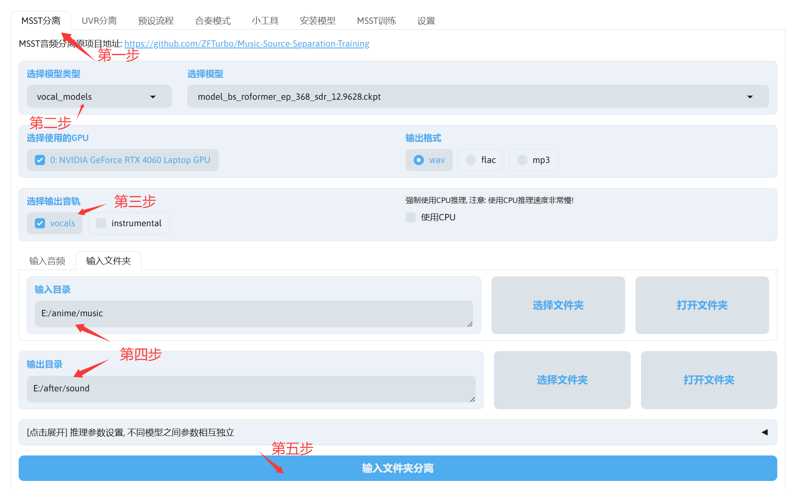
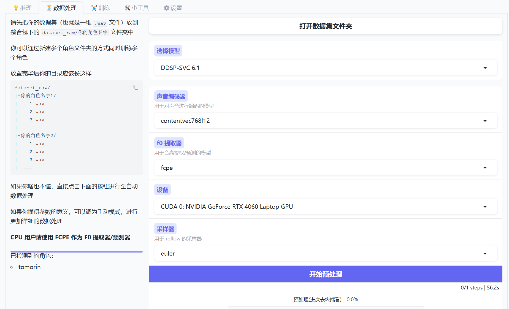
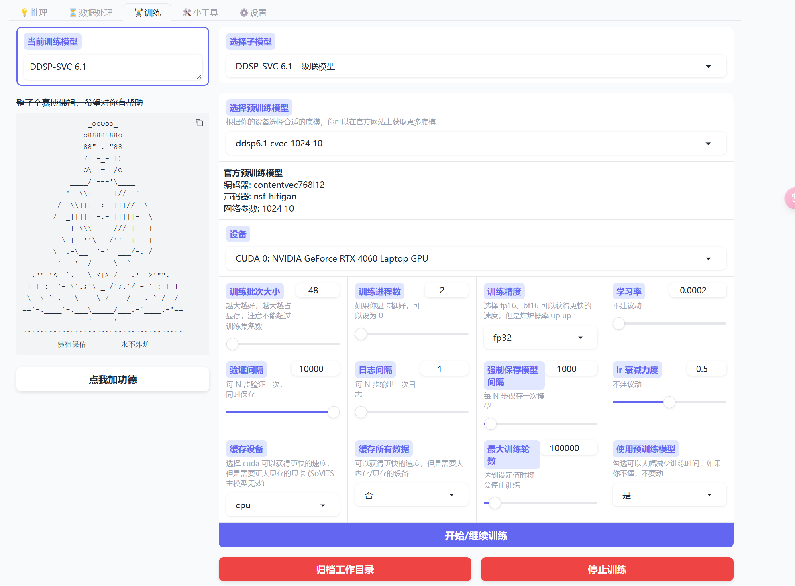
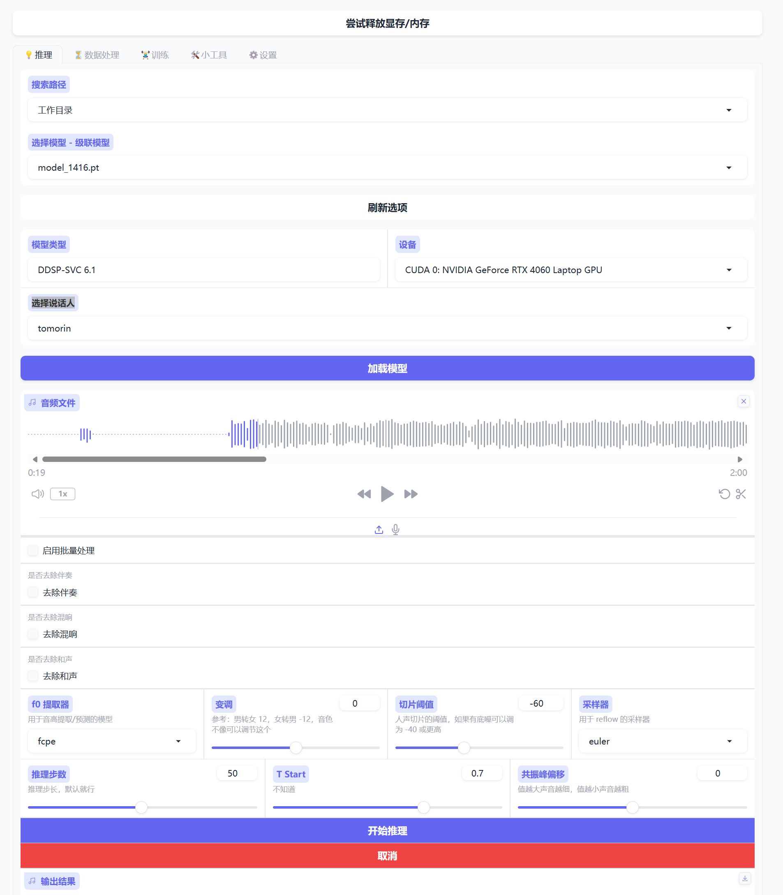

# 如何做一个ai翻唱的视频

### 第一步 获取数据集
首先我们需要数据集（去训练自己要的角色的模型），简单来说，我们需要角色说话的录音。
那么怎么获取呢，可以直接伸手要（x，当然是自己去分离啦

使用**MSST-WEBUI整合包**，截至2025-2-3，已经是1.7.0了  
作者 [bilibili@Sucial丶](https://space.bilibili.com/445022409)  
[github项目开源地址](https://github.com/SUC-DriverOld/MSST-WebUI)  
[官方教程文档看这里](https://r1kc63iz15l.feishu.cn/wiki/JSp3wk7zuinvIXkIqSUcCXY1nKc)  
[官方教程视频看这里](https://www.bilibili.com/video/BV18m42137rm)  

我的简易教程
1. 打开教程文档，下载FULL版本setup（名字大概这样，版本可能不一样Setup_MSST_WebUI_1.7.0_v2_Full.exe）
2. 打开教程文档，下载vocal_models的model_bs_roformer_ep_368_sdr_12.9628.ckpt模型分离人声和伴奏
3. 打开教程文档，下载single_stem_models的deverb_bs_roformer_8_256dim_8depth.ckpt模型去混响
4. 下载好setup后运行，安装我们的MSST-WEBUI
5. 右键管理员第一次运行MSST-WEBUI
6. 把模型放到你MSST-WEBUI程序目录下的pretrain文件夹的对应子文件夹
7. 打开MSST-WEBUI的界面，根据需求配置下面的选项
8.   

现在我们拿到我们的数据集了。好耶！

### 第二步 训练我们的模型，并得到我们的歌
我们获得的数据集肯定需要**SVC（歌声转换）项目**来训练自己的模型啦，那么有没有适合小白的整合包呢，有的兄弟有的  

使用**SVC Fusion**整合包，集成了 So-VITS4.1，DDSP6.0，ReFlow-VAE-SVC 三个项目
截至2025-2-3，目前已经停更
易于使用 | 可用 CPU 训练 | 面向小白 歌声转换
Qt版本作者：[bilibili@爱过_留过](https://space.bilibili.com/399248533)  
[文档地址](https://www.svcfusion.com/neovim-runtime)  
[视频教程](https://www.bilibili.com/video/BV1ur42177iP)  

我的简易教程:
1. 打开官方文档下载最新的安装包
2. 第一次运行，会提示缺少应用，我们直接按照指示下载
3. 下载好后运行
4.   
5. 打开数据集文件夹，按照目录要求放入wav文件，基本默认配置是对的，直接点击开始预处理，等结果
6. 进入训练模块，点击开始训练（默认配置，如果懂得可以自己来）  
7. 每1000步看一眼模型，如果够了就停。
8. 进入推理模块，选择模型，选择说话人，加载模型，上传要让角色唱的歌，直接**开始推理**，等结果。  
